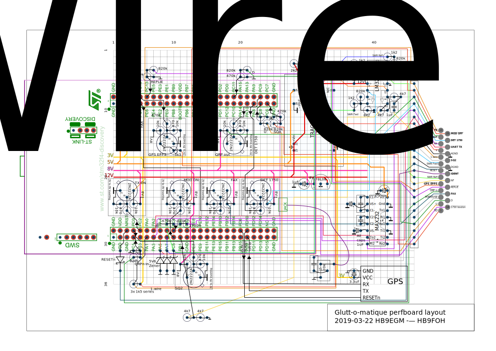

Glutt-o-matique
===============

La nouvelle logique de la Glutte voit le jour ici.

On va utiliser un stm32f4-discovery. La collaboration
est gérée à l'aide d'un
[Trello](https://trello.com/b/NSvh8v81),
qui sert aussi d'aide-mémoire.

[La Glutte](http://www.glutte.ch)

L'essence de la glutt-o-matique
-------------------------------

Notre but  
est que la glutte  
fasse des tût-tûts.

Pour faire écho  
des beaux QSO  
depuis là-haut.

Donner comme retour  
entre chaque tour  
une lettre nuit et jour

Économiser l'energie  
pour la longue vie  
de la batterie.

Tout en annoncant  
le beau temps  
régulièrement.

Structure
---------

.

